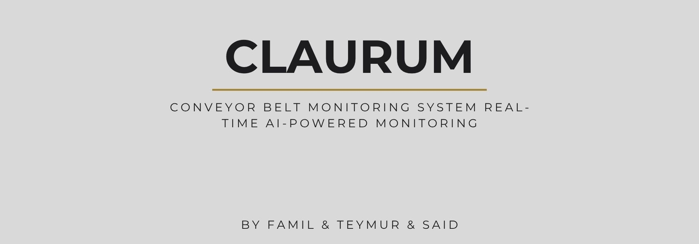

# Bread Detection System (Claurum)

<p align="center">
  
</p>


Real-time bread detection and tracking using YOLOv8 with live camera feed. Includes a desktop app (Electron), data augmentation pipeline, and utilities for camera discovery and database configuration.

## 📁 Structure

```
Bread-Detection-Novum/
├── cameraFinder.py             # Camera discovery utilities
├── camera_source.txt           # Saved camera RTSP/URL sources
├── database-config.py          # DB connection/config utilities
├── live-detection.py           # Real-time camera detection (live inference)
├── optimized-live-detection.py # Optimized/alternate live detection script
│
├── Transformations/            # Data processing pipeline
│   ├── dataAugmentation.py     # Dataset augmentation logic
│   └── AllTransformations.py   # Custom transformation functions
│
├── requirements.txt            # Python dependencies
├── README.md
│
├── APP/                        # Electron desktop application
│   ├── src/                    # Frontend (React components)
│   ├── electron/               # Electron main process (Node.js backend)
│   ├── package.json
│   └── vite.config.js
│
└── data/                       # Model storage
    ├── best.pt                 # Custom trained YOLOv8 model
    ├── yolov8s.pt              # Base YOLOv8 model
    └── yolov8s-seg.pt          # YOLOv8 segmentation model
```

## 📄 Files

- **live-detection.py** - Real-time detection from RTSP camera
- **optimized-live-detection.py** - Alternate/optimized live detection script
- **dataAugmentation.py** - Data augmentation with Albumentations
- **APP/** - Electron desktop application (React frontend)

## 🚀 Setup

**Python:**
```bash
pip install -r requirements.txt
python live-detection.py            # Live camera detection
python optimized-live-detection.py  # Alternate/optimized live detection
```

**Electron App:**
```bash
cd APP
npm install
npm run dev                         # Development
npm run dist                        # Build

## ⚙️ Configuration

**Camera (live-detection.py):**
```python
rtsp_url = "rtsp://192.168.0.112:554/rtsp/streaming?channel=01&subtype=0"
```

**Detection Settings:**
- `device="cuda"` → GPU (change to `"cpu"` if no GPU)
- `imgsz=640` → Image size (use `416` for weaker GPU or faster inference)
- `conf=0.25` → Confidence threshold

## 🐛 Troubleshooting

| Issue | Solution |
|-------|----------|
| Camera not found | Check RTSP URL |
| Slow detection | Use `imgsz=416` or `device="cpu"` with YOLOv8 Nano |
| Import errors | Run `pip install -r requirements.txt` |

## 📦 Models

- `best.pt` - Custom bread detection model
- `yolov8s.pt` - YOLOv8 Small detection
- `yolov8s-seg.pt` - YOLOv8 segmentation

---
**License:** ISC
